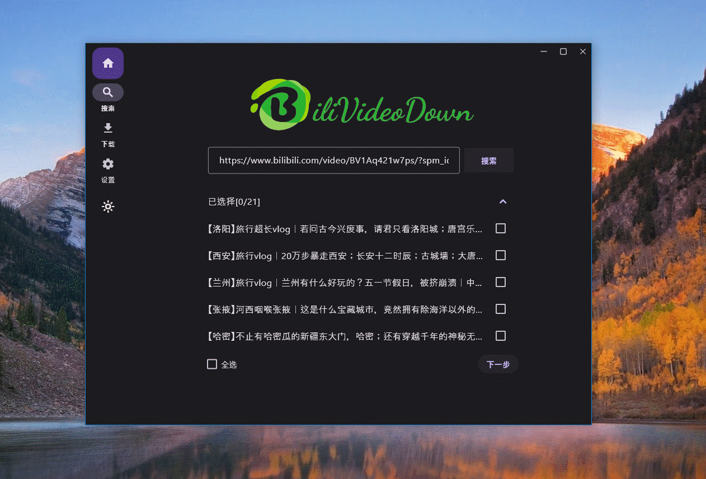

<div align="center">
    

<h1 align="center">BiliVideoDown</h1>

English / [简体中文](./README_CN.md)

BiliVideoDown is a desktop app primarily designed for download video of bilibili website (https://www.bilibili.com/).


</div>

## Support Platform

- windows 10
- macOS

## Local Development

```
# windows platform
flutter run -d windows
# macOS platform
flutter run -d macOS
```

## Screenshots



## Others

I've created a WeChat group specifically for Flutter developers. If you're interested in, just scan the code below and send message "交流群".


## License

[GPL](https://opensource.org/license/gpl-3-0)
